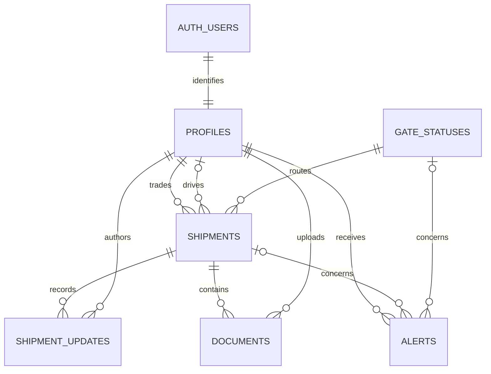

# Database design and workflow contract

This is the final MVP schema contract. Phases 2–4 provide the foundation, Trader and Admin functions. `20260914000300_driver_workflow.sql` adds Driver updates and private evidence policies/registration. All five migrations are applied to the configured hosted project. Application tables live in `public` with RLS enabled; authorization helpers live in non-exposed `private`. Gate alerts and the local offline queue remain planned; Driver UUID retries are supported now.

## Common conventions

- IDs are UUIDs, default `gen_random_uuid()` unless stated otherwise. All timestamps use `timestamptz` and default `now()` where appropriate; display in `Asia/Yangon`.
- `app_role`: `admin`, `trader`, `driver`.
- `shipment_status`: `requested`, `approved`, `picked_up`, `in_transit`, `arrived_at_checkpoint`, `customs`, `delivered`. UI labels use title case.
- `gate_status`: `open`, `delayed`, `closed`.
- `sync_status`: `pending`, `synced`. Pending payloads exist locally; committed server updates must be `synced`.
- Required text is trimmed/nonempty. Coordinate values must be a pair or both NULL; latitude in `[-90,90]`, longitude in `[-180,180]`.
- Profile references use `ON DELETE RESTRICT` to preserve shipment history. `profiles.id` references `auth.users(id) ON DELETE CASCADE`; an account involved in history cannot be deleted until explicitly dealt with by an administrator. Gate references use `RESTRICT`.

## profiles

| Column | Type / constraints |
| --- | --- |
| id | UUID PK; references `auth.users(id)`; no random default |
| full_name | text NOT NULL, 1–120 chars |
| email | text NOT NULL; unique index on `lower(email)`; mirrored from verified Auth data |
| role | app_role NOT NULL DEFAULT `trader` |
| created_at | timestamptz NOT NULL DEFAULT now() |

An Auth trigger creates a trader profile. Never derive an elevated role from user-editable signup metadata. Demo admin/driver provisioning is a trusted setup operation. Clients cannot change `role`, `id`, or `email`; an authenticated user may update only their own `full_name`. Auth email changes mirror through a trusted trigger.

## gate_statuses

| Column | Type / constraints |
| --- | --- |
| id | UUID PK |
| gate_name | text NOT NULL UNIQUE, e.g. Muse, Myawaddy |
| location | text NOT NULL; human-readable location |
| status | gate_status NOT NULL DEFAULT `open` |
| reason | text NOT NULL DEFAULT ''; max 1,000 chars; required for delayed/closed |
| updated_by | UUID NULL references profiles(id); NULL only for initial seed |
| updated_at | timestamptz NOT NULL DEFAULT now() |

## shipments

| Column | Type / constraints |
| --- | --- |
| id | UUID PK |
| shipment_number | text NOT NULL UNIQUE; generated from database sequence as `MMT-000001` |
| trader_id | UUID NOT NULL references profiles(id); must be a trader |
| driver_id | UUID NULL references profiles(id); when set, must be a driver |
| origin | text NOT NULL, 1–160 chars |
| destination | text NOT NULL, 1–160 chars |
| cargo_type | text NOT NULL, 1–80 chars |
| cargo_description | text NOT NULL, 1–2,000 chars |
| quantity | numeric(12,2) NOT NULL CHECK > 0 |
| quantity_unit | text NOT NULL DEFAULT `tonnes`; CHECK IN (`tonnes`, `kg`, `packages`) |
| pickup_date | date NOT NULL; creation/edit validation rejects past Myanmar-local dates |
| route_gate_id | UUID NOT NULL references gate_statuses(id) |
| status | shipment_status NOT NULL DEFAULT `requested` |
| current_lat | double precision NULL with coordinate check |
| current_lng | double precision NULL with coordinate check |
| special_notes | text NOT NULL DEFAULT ''; max 2,000 chars |
| created_at | timestamptz NOT NULL DEFAULT now() |
| updated_at | timestamptz NOT NULL DEFAULT now(); server-maintained |

Origin must differ from destination after trim/case normalization. `quantity_unit` supplements the requested fields to avoid ambiguous quantities. No destructive shipment deletion in the MVP. Assignment is an admin operation; an approved shipment must have a driver. Changing the assigned driver after pickup is not supported in the MVP.

## shipment_updates

| Column | Type / constraints |
| --- | --- |
| id | UUID PK; client-generated UUID is reused on offline retry |
| shipment_id | UUID NOT NULL references shipments(id) ON DELETE CASCADE |
| driver_id | UUID NULL references profiles(id); set only for driver-authored updates |
| actor_id | UUID NOT NULL references profiles(id); identifies trader/admin/driver author |
| status | shipment_status NOT NULL |
| note | text NOT NULL DEFAULT ''; max 2,000 chars |
| latitude | double precision NULL with coordinate check |
| longitude | double precision NULL with coordinate check |
| sync_status | sync_status NOT NULL DEFAULT `synced`; server CHECK = `synced` |
| occurred_at | timestamptz NOT NULL; when captured on device; informative only |
| created_at | timestamptz NOT NULL DEFAULT now(); server acceptance time |

`actor_id` supplements `driver_id` so request creation and admin actions also appear in the timeline. Timeline order uses server acceptance time; device time is displayed separately when relevant. Update rows are append-only. A duplicate UUID returns the original result only if shipment, actor, and payload match; a conflicting reuse is rejected.

## alerts

| Column | Type / constraints |
| --- | --- |
| id | UUID PK |
| trader_id | UUID NOT NULL references profiles(id) |
| shipment_id | UUID NULL references shipments(id) ON DELETE CASCADE |
| gate_id | UUID NULL references gate_statuses(id) |
| title | text NOT NULL, 1–160 chars |
| message | text NOT NULL, 1–2,000 chars |
| is_read | boolean NOT NULL DEFAULT false |
| created_at | timestamptz NOT NULL DEFAULT now() |

Each row targets one trader. Shipment alerts must reference that trader's shipment. Gate alerts also reference its route. Admin broadcasts create one row per trader with NULL shipment/gate; there is no globally readable recipient-free alert. Only `is_read` may be changed by its recipient.

## documents

| Column | Type / constraints |
| --- | --- |
| id | UUID PK |
| shipment_id | UUID NOT NULL references shipments(id) ON DELETE CASCADE |
| driver_id | UUID NOT NULL references profiles(id) |
| document_type | text NOT NULL CHECK IN (`photo`, `delivery_receipt`, `customs`, `other`) |
| file_url | text NOT NULL UNIQUE; private Storage object path, not a public URL |
| original_name | text NOT NULL; max 255 chars |
| mime_type | text NOT NULL CHECK IN (`image/jpeg`, `image/png`, `application/pdf`) |
| size_bytes | bigint NOT NULL CHECK > 0 AND <= 10485760 |
| created_at | timestamptz NOT NULL DEFAULT now() |

Keep the requested `file_url` name, but store a stable private path such as `<shipment_id>/<driver_id>/<document_id>.pdf`. Generate short-lived signed download URLs after authorization, never persist expiring URLs. Bucket `shipment-documents` is private, limited to 10 MiB and the allowed MIME types. Validate path ownership, active assignment, MIME type and size on upload. Drivers may upload for their own assigned shipment; permitted shipment viewers may download. Upload first, insert metadata second, and remove the just-created object if metadata creation fails. Offline photo upload is outside MVP scope.

## Relationships

## Authorization and mutation contract

| Resource | Admin | Trader | Driver |
| --- | --- | --- | --- |
| Profiles | Read profiles; assignment candidates | Own profile; assigned driver's limited contact/name projection | Own profile |
| Shipments | Read all; assign/approve/correct through functions | Read own; create; edit request fields only while requested | Read assigned only |
| Updates | Read all; append status correction | Read own shipment history | Read assigned history; append via validated function |
| Gates | Read; change status/reason | Read | Read |
| Alerts | Read all; broadcast | Read own; mark own read | No access |
| Documents / Storage | Read all | Read own shipment evidence | Read/upload assigned shipment evidence |

Unauthenticated users cannot access operational tables or files. Profile email data is not broadly exposed: trader shipment details get the assigned driver's limited fields via a function that checks ownership. No client can self-promote.

RLS alone limits rows, not which columns or transitions can change. Revoke unrestricted writes and expose narrowly scoped functions for business mutations, checking `auth.uid()` and the caller's role on every call. Definer functions have a fixed safe search path, schema-qualified references, explicit execution grants, and no arbitrary SQL. Role lookup uses a private helper to avoid recursive profile policies. Grants, RLS policies, and function checks are tested together against direct API calls.

- `create_shipment`: validates request data; derives trader from session; inserts requested shipment plus initial timeline event atomically.
- `edit_requested_shipment`: locks the row, checks trader ownership and requested status, and allows only request fields. Cannot alter trader, driver, status, number, or coordinates. Requires the exact previously read `updated_at`; stale edits return `PT409` (HTTP 409), and no-longer-requested shipments return `PT422` (HTTP 422). A successful edit appends one event atomically. These are expected client conflicts, not database serialization failures.
- `shipment_driver_name`: returns only the assigned driver's name after checking shipment visibility; does not broaden profile or email access.
- `manage_shipment`: implemented Admin-only entry point for `assign`, `approve` and `status` operations. Locks the shipment and compares its expected revision. Assignment requires a driver profile and is prohibited after any recorded pickup/progress, even if status was corrected backward. Approval requires an assigned requested shipment. Corrections require an already-approved shipment and a reason, and cannot reopen trader editing by returning to Requested. Successful actions append an Admin-authored event atomically. Driver, owner and GPS fields cannot be changed through the correction operation.
- `append_driver_update`: implemented for the assigned Driver only. Locks the shipment, requires approval, validates forward/same-state progress and the expected revision, inserts an immutable Synced update and changes latest status/GPS atomically. Blank GPS preserves the prior coordinates. Identical UUID/payload retries return the original result even after subsequent progress; conflicting UUID reuse fails. Admin corrections use `manage_shipment` instead. Shipment notifications remain a later phase.
- `register_shipment_document`: verifies assigned Driver, approval, exact private object path, allowed type/extension, recorded Storage MIME/size and 10 MiB limit. Repeated identical registration is idempotent. Evidence may be attached after delivery, while new progress updates are forbidden. Storage insert policy permits only the assigned Driver's path; orphan read/delete policies allow that Driver to clean an unregistered upload. Registered evidence remains readable only through shipment authorization and cannot be overwritten or directly deleted by normal clients.
- Driver updates require approval and progress forward among picked up, in transit, checkpoint, customs, delivered. Forward skips are permitted so the requested demo can go from picked up to checkpoint. Same-state GPS/note updates are permitted. Delivered is terminal for drivers. Admin corrections require a note; status/assignment and coordinates cannot be written directly by drivers.
- `change_gate_status`: implemented Admin-only function; locks gate, checks expected revision, changes status/reason, sets actor/time. Delayed/Closed requires a nonempty reason. Phase 7 will add a database trigger creating one alert per affected non-delivered shipment on actual changes to Delayed/Closed; it must not duplicate notifications when only the note changes. Automatic alerts are not implemented in Phase 4.
- `broadcast_alert`: admin only, validates content and inserts recipient-specific alert rows.
- `mark_alert_read`: derives recipient from session; changes only their alert's read flag.

## Offline synchronization

Each local entry contains the UUID, authenticated driver ID, shipment ID, status, note, optional coordinates, device timestamp, and `pending` state. Restoring connectivity offers manual Sync; pending items replay sequentially and become synced only after acknowledged commit. Network errors remain pending. Validation/assignment conflicts remain visible with a reason and require review; never silently discard or overwrite server state. If a response is lost after commit, retrying the same UUID cannot create another event. No local queue contents grant authorization. A simulated offline toggle and actual `navigator.onLine` events both feed the UI; network request failures are still handled independently.

## Indexes and Realtime

- `shipments(trader_id, created_at DESC)`, `(driver_id, updated_at DESC)`, `(route_gate_id, status)`.
- `shipment_updates(shipment_id, created_at DESC)` and indexes on actor/driver FKs.
- `alerts(trader_id, is_read, created_at DESC)` and shipment/gate FK indexes.
- `documents(shipment_id, created_at DESC)` and driver FK index; `gate_statuses(updated_by)`.
- Migration `20260915000100_realtime_tracking.sql` publishes INSERT/UPDATE on shipments, shipment_updates, gate_statuses, documents and alerts. SELECT policies filter delivery; subscriptions are removed on sign-out/unmount. DELETE/TRUNCATE publication is disabled to avoid deleted-row identifier disclosure. The migration refuses to alter a publication containing unrelated tables.
- `shipment_milestones(uuid)` returns per-status first/last recorded timestamps and event counts over complete history. Its restricted security-definer function checks `private.can_view_shipment` before aggregation; anonymous and unrelated callers are denied. No role or mutation privileges were broadened.

## Demo seed plan

Use a trusted server-only setup script to provision Auth users first, then profiles and related data. Do not embed credentials or elevated keys in migrations/client code. Seed repeatably by known demo identifiers without deleting unrelated data.

- `admin@demo.com`, `trader@demo.com`, `driver@demo.com` with the documented development-only password.
- Initial Muse and Myawaddy gates Open, explicitly simulated.
- Yangon → Muse: in transit; Yangon → Myawaddy: requested; Mandalay → Muse: customs. Include appropriate historical updates and a driver for active shipments.
- Integration tests add a second trader and second driver to prove isolation; these need not appear in the customer demo.
